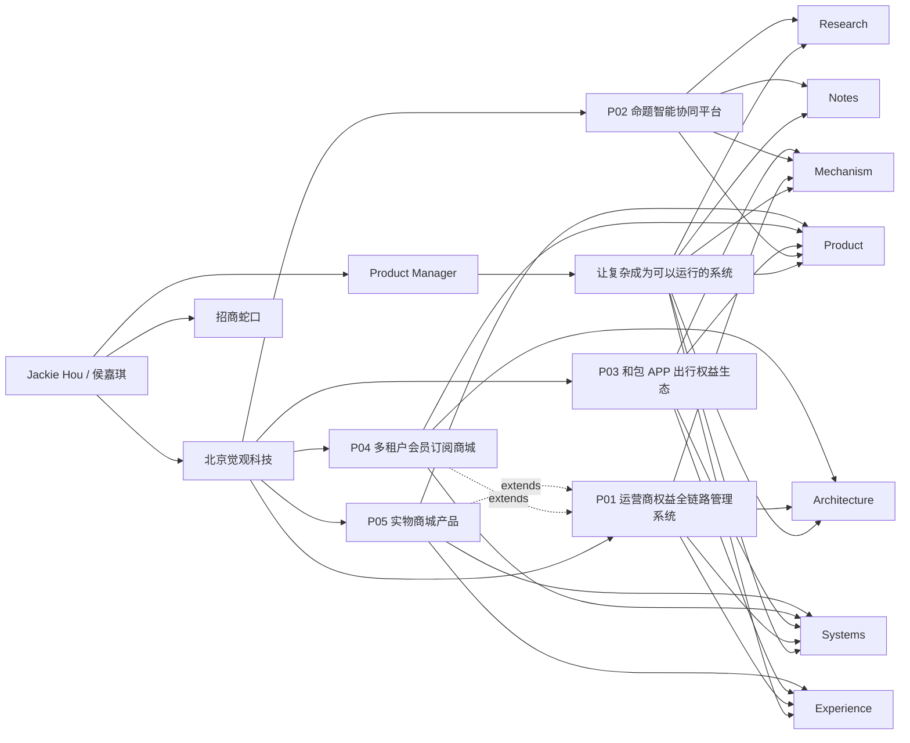
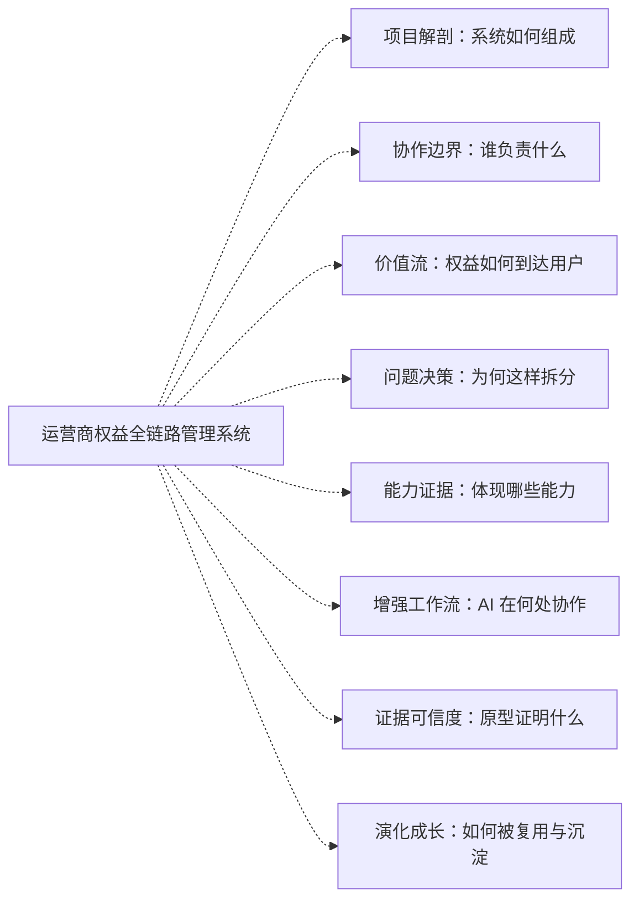
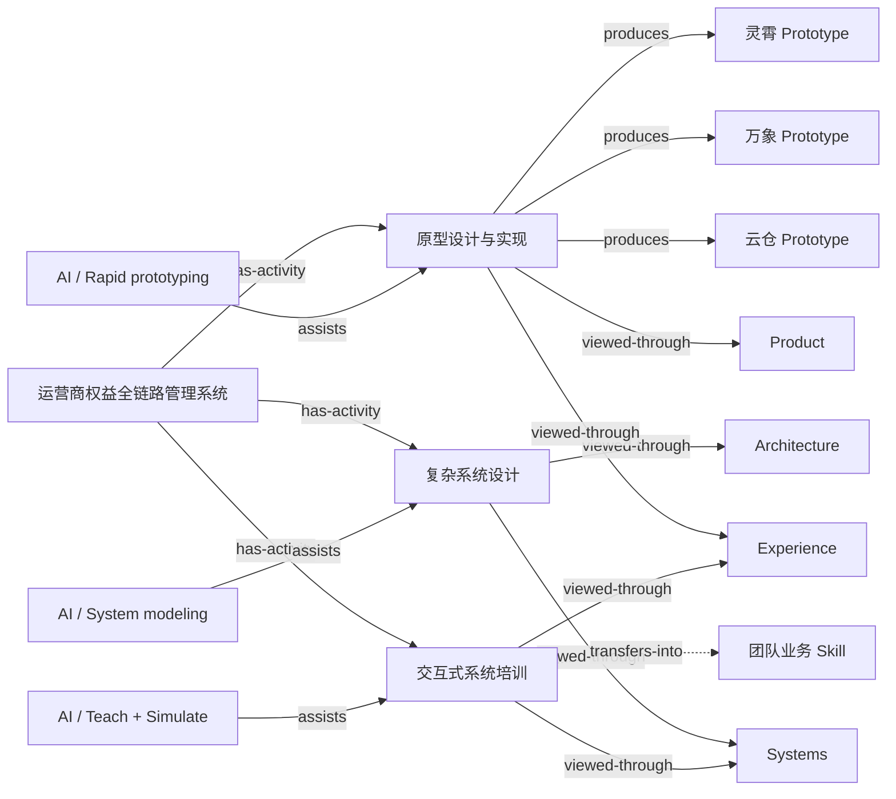
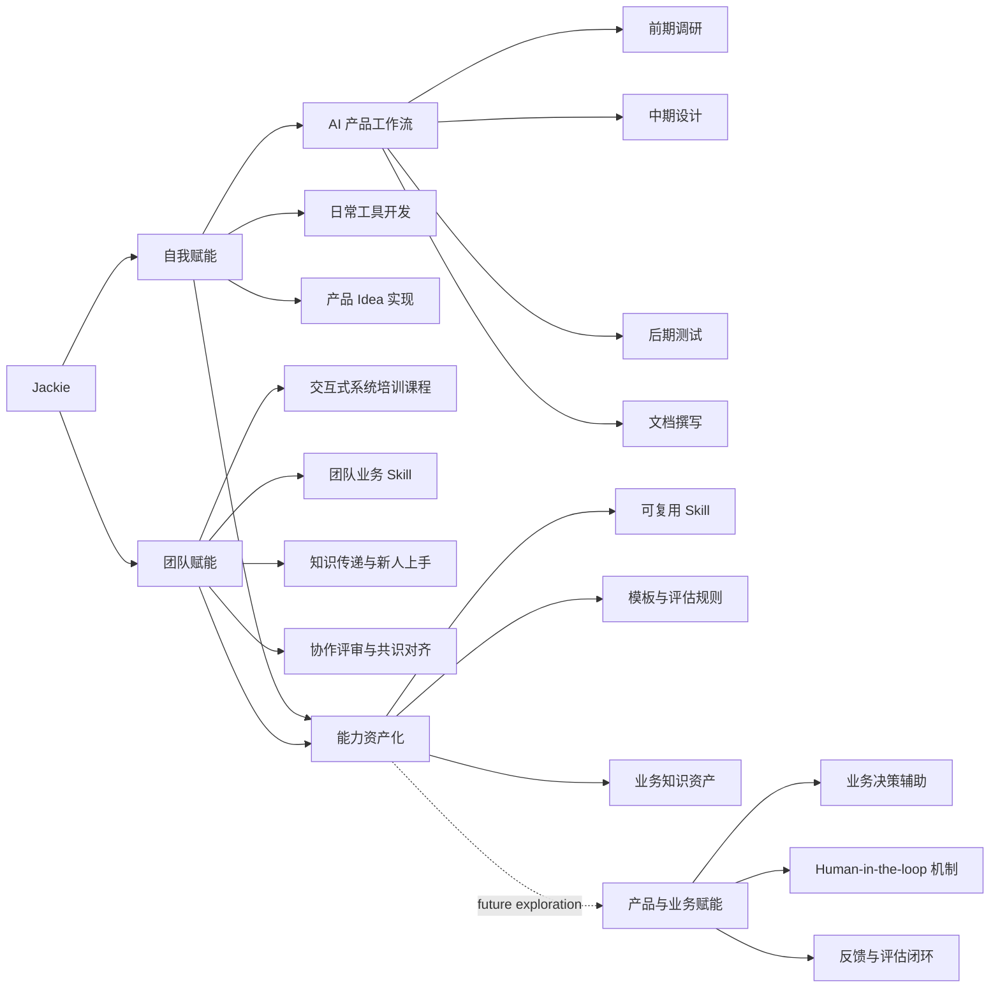
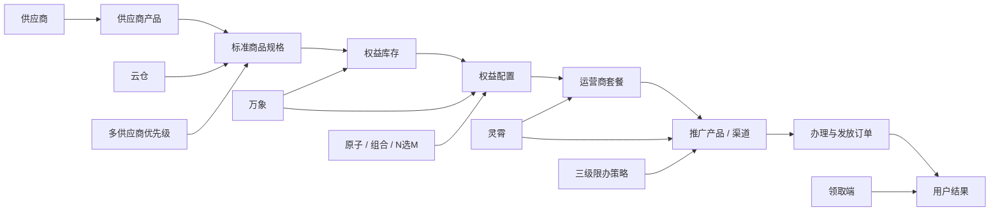
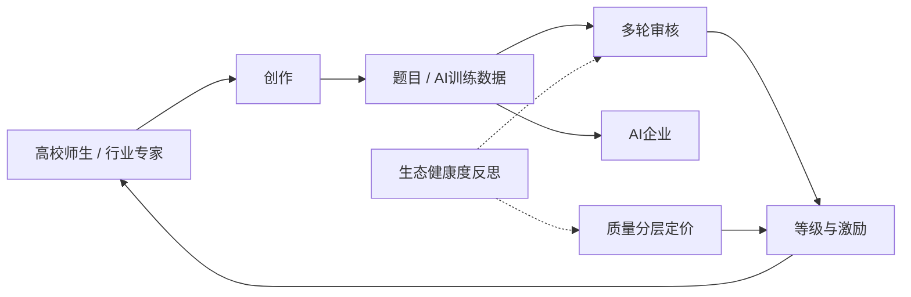
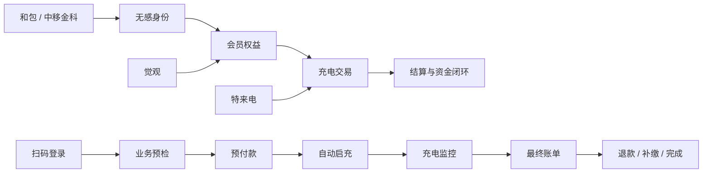
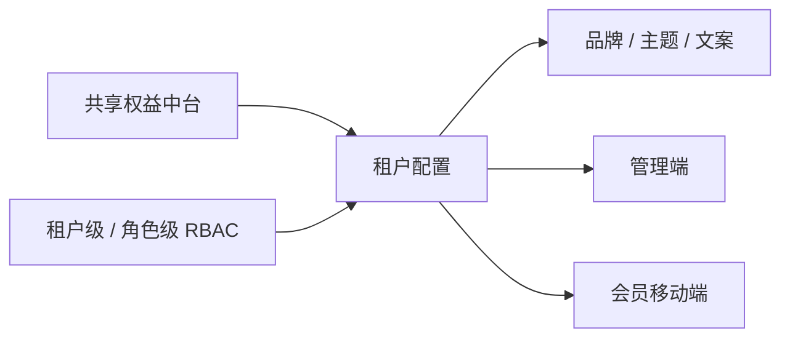
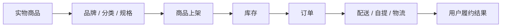

# Portfolio logic network

This document explains the human-readable structure behind `lab/data/portfolio-network.json`. The JSON file is the canonical machine-readable graph for future Spatial Graph and Spatial Canvas experiments.

## 1. What the network represents

The network is a heterogeneous, multiplex knowledge mesh—not a file tree, sitemap, one-way hierarchy, or collection of disconnected diagrams. It has one stable semantic base in which several relation layers coexist. Different cameras reweight and spatially expose that mesh without changing its factual topology.

Shared facets describe five reusable dimensions:

1. **Domain** — Product, Systems, Mechanism, Experience, Research, Architecture, and Notes.
2. **Scope** — self, team, project, business, and ecosystem.
3. **Lifecycle** — discover, define, model, design, build, test, deliver, operate, and learn.
4. **Knowledge depth** — concept, method, decision, project, artifact, evidence, and reflection.
5. **AI mode** — co-think, co-create, automate, simulate, teach, codify, and evaluate.

Identity, experience, project, actor, system, activity, decision, artifact, metric, and note are node types rather than fixed layers. Relations determine how they can be traversed. A camera profile supplies anchors, relation weights, semantic forces, clustering bias, and an optional guided path.

This distinction matters:

- A **filter** temporarily hides or limits content.
- An **overlay** changes emphasis or annotation.
- A **camera** changes the spatial reading of the continuous mesh.
- A **narrative** proposes a path through it.
- The node `project:rights-management`, for example, keeps one identity and neighborhood while being observed as a system junction, capability example, AI-workflow context, evidence source, or point in an evolving body of work.

Individual prototype routes are intentionally collapsed into evidence nodes. They can be expanded later inside a project-specific evidence view, but they should not compete with projects on the homepage.

## 2. Global structure



The homepage is only one projection of this graph. Project nodes are not navigation cards; they are high-weight points connected to themes, activities, evidence, and other projects.

## 3. Continuous multiplex mesh

The model is one continuous three-dimensional semantic mesh, not a collection of alternate graphs. Its depth comes from several relation layers occupying the same space:

```text
project structure + actor boundaries + value/state flow + problem/decision logic
+ capability recurrence + human/AI practice + evidence + time/reuse/reflection
= one multiplex mesh
```

A project is therefore not copied into several diagrams. It is one junction where system, capability, process, practice, evidence, and temporal relations intersect.

Three presentation mechanisms operate over this factual mesh:

```text
Stable semantic base
= nodes + typed edges + evidence status + shared facets + temporal facts

Camera profile
= anchor + relation weights + semantic forces + cluster bias

Overlay
= temporary emphasis or filtering without rebuilding topology

Narrative
= a curated path through one or more camera profiles
```

This avoids treating every possible angle as another navigation category. A camera profile never replaces the graph: it increases the force, opacity, or proximity of relevant relations while preserving the focused node and its directly connected layers. Domain, lifecycle, AI mode, and evidence status are usually Overlays. A career story or case-study walkthrough is a Narrative.

There is deliberately no permanent X/Y/Z coordinate system. The current model contains seven semantic fields—project, capability, workflow, boundary, evidence, temporal, and enablement gravity—and nine camera profiles derived from the actual portfolio content:

| Family | Camera profile | Primary question | Typical anchor |
| --- | --- | --- | --- |
| Orientation | 作品全景 | How does the body of work fit together? | Identity / thesis |
| System understanding | 项目解剖 | What makes this project work? | Project |
| System understanding | 角色与协作边界 | Who owns, operates, hands off, or depends on what? | Project / actor |
| System understanding | 价值与状态流 | How does value or state cross systems and reach a user result? | Journey / object |
| Product reasoning | 问题与决策 | What tension or constraint led to each decision? | Problem / decision |
| Product reasoning | 能力与案例证据 | Where does a capability recur and what proves it? | Theme / activity |
| Practice and proof | 增强型产品工作流 | How is product work performed, AI-assisted, transferred, and reused? | Activity |
| Practice and proof | 证据与可信度 | Which claims are inspectable, uncertain, or forecast? | Evidence / metric |
| Evolution | 时间、迁移与成长 | What happened when, what was reused, and what was learned? | Education / experience / project |

These are not nine permanent homepage buttons or nine disconnected modes. The homepage starts with the `portfolioConstellation` camera. Focusing a node can smoothly rotate or reweight the mesh toward two or three relevant readings while quiet one-hop context remains visible.

The same project therefore supports many simultaneous readings without being duplicated:



The lines in the time/growth view require special care: calendar order is a fact, but a growth explanation is an interpretation. The data therefore separates `careerChronology` from `growthHypothesis`; the latter remains `needs-confirmation` until Jackie validates it.

### Shared activity bridge

Neutral activity nodes are the bridge between projects, portfolio angles, AI collaboration, and concrete artifacts.



This graph can be traversed in any direction:

```text
项目 → 原型设计 → AI 协作方式 → 自我赋能
项目 → 复杂系统设计 → Systems / Architecture
Systems → 复杂系统设计 → 多个相关项目
AI Rapid Prototyping → 原型设计 → 所有相关 Prototype
Prototype → 原型设计 → 项目 → 决策与系统对象
项目知识 → 交互式培训 → 团队业务 Skill → 能力资产化
```

An edge can remain semantically directed while supporting navigation in both directions. For example, prototype design `produces` a prototype, but selecting the prototype must still let the reader travel back to the activity and project that produced it.

Each camera profile applies different semantic forces to the same mesh. For example:

```text
Project anatomy: lifecycle/value flow × actor/system boundary × evidence depth
Stakeholder boundary: upstream/downstream party × responsibility zone × handoff consequence
Value/state flow: process time × system lane × normal/exception/recovery
Problem/decision: problem/response/consequence × trade-off type × evidence maturity
Capability/evidence: capability family × project context × method/evidence maturity
Augmented practice: workflow phase × human/AI/output lane × self/team/business reuse
Evidence trace: claim/source × context × confidence status
Evolution/learning: calendar time × context lane × fact/reuse/reflection

Overlays = domain + scope + lifecycle + AI mode + evidence status + focus depth
```

Changing camera may rearrange relative positions, but a node keeps its identity and factual neighborhood. Direct relations may become quiet; they must not silently disappear from the model.

## 4. AI as embedded enablement

AI is not an independent homepage topic. It is expressed through the product work, methods, team practices, and reusable assets that it enables.



### 4.1 自我赋能

AI participates in the complete personal product loop rather than only generating isolated deliverables.

```text
前期调研
→ 信息收集、结构化、对比、归纳

中期设计
→ 系统建模、方案发散、交互与逻辑 Prototype

后期测试
→ 流程检查、规则冲突、异常状态、可访问性与实现验证

文档撰写
→ PRD、规则说明、测试记录、决策日志与待确认项
```

Daily tool development and product-idea realization are parallel outputs of the same loop. The important evidence is not “using an AI tool,” but turning an idea or repeated task into something runnable and verifiable.

### 4.2 团队赋能

AI-assisted outputs become useful to a team only after individual reasoning is translated into a shared learning or operating format.

- **交互式系统培训课程** — use system maps, role switching, state scenarios, and guided exercises instead of static slide-only training.
- **团队业务 Skill** — encode recurring business rules, terminology, operating procedures, and reasoning paths as team-usable skills.
- **知识传递与新人上手** — connect concepts, boundaries, common exceptions, and real examples so new members can learn the system progressively.
- **协作评审与共识对齐** — use shared checklists and simulations to surface interpretation differences before delivery.

The first two items are user-confirmed directions. Onboarding and collaborative review are logical extensions and remain marked `experimental` until supported by real artifacts.

### 4.3 能力资产化

This is the bridge between self and team enablement:

```text
一次性 Prompt / 对话
→ 稳定工作流
→ 可复用 Skill 或小工具
→ 模板、评估规则与知识资产
→ 团队培训、协作和持续更新
```

It prevents AI practice from being described only as personal efficiency. The durable value is whether knowledge can be reused, reviewed, transferred, and improved.

### 4.4 产品与业务赋能

This is a proposed fourth direction and is intentionally marked `experimental`:

- Traceable AI-assisted decision support
- Human review, correction, escalation, and accountability inside product flows
- Feedback and evaluation loops that connect user outcomes to later iteration

It should enter the public portfolio only when a real product case or verified experiment supports it.

### 4.5 Human ownership and constraints

Jackie continues to own:

- Problem definition, business context, and success criteria
- Product trade-offs and final decisions
- Evidence review and factual verification
- Ownership, attribution, and public-disclosure decisions

Hard constraints remain unchanged:

- AI output is not evidence for a metric.
- AI must not infer Jackie's ownership or business impact.
- Final business interpretation remains human-verified.
- Tool names are implementation details rather than permanent first-level nodes.

The Spatial Portfolio Lab currently evidences self enablement and the beginning of capability assetization: it combines content auditing, graph modeling, visual prototyping, implementation, verification, and a reusable network data source.

## 5. Project subgraphs

### P01 — Operator benefits lifecycle



This is the strongest architecture case and should receive the largest homepage project weight.

### P02 — Question creation ecosystem



The project's distinguishing capability is mechanism and ecosystem design, not AI branding.

### P03 — Charging service orchestration



This case connects product orchestration, system truth, recovery mechanisms, and user-facing state translation.

### P04 — Multi-tenant subscription mall



This project extends the shared platform capability represented by P01.

### P05 — Physical commerce extension



This project extends the benefit-operation platform into physical fulfillment.

## 6. Rendering contract

### Camera movement through the mesh

The interface should treat a reading angle as a camera movement and force reweighting, not as a switch between separate diagrams.

- Preserve the focused node ID and its factual one-hop neighborhood while changing camera.
- Use `anchorNodes` as suggested gravity centers, not an allow-list.
- Increase force and opacity for `emphasizeNodeTypes` and `emphasizeEdgeTypes`; keep other direct relations quiet but reachable.
- Re-layout with the camera's `semanticForces`, `spatialBias`, and `clusterBias`.
- Use `guidedPath` only as optional editorial guidance; free exploration remains available.
- A reader may rotate from “project anatomy” toward “problem and decision” or “capability and evidence” while staying on the same project.
- Do not expose all camera profiles at once. Recommend them from the focused node and available relations.
- Overlays may be combined with any camera, but must not rewrite the underlying relation set.

### Spatial Graph homepage

Render nodes listed in `views.home.defaultVisible`.

- Keep Jackie, the role, and the central thesis spatially stable.
- Use theme nodes as the first semantic ring.
- Use project nodes as weighted evidence of those themes.
- Reveal only one-hop relations on hover or keyboard focus.
- Never render metric nodes in the initial view.
- Selecting a project opens its local Spatial Canvas.
- AI enablement appears contextually beside the theme, method, experience, or artifact it supports; it does not open as a disconnected homepage island.

### Spatial Canvas detail

Resolve the selected root, then include:

1. Nodes whose `scope` matches the project ID.
2. Shared activity nodes connected through `has-activity`.
3. Theme, AI-practice, and artifact nodes reached through `viewed-through`, `assists`, and `produces`.
4. Team-transfer and cross-project relations reached through `transfers-into` and `extends`.
5. Evidence and metrics only after the project's core structure is visible.

The initial composition may use the following depth order, but navigation remains multidirectional:

```text
Project
→ Activities
→ Themes and AI collaboration
→ Actors
→ Objects and systems
→ Mechanisms and decisions
→ Journey
→ Evidence
→ Metrics and notes
```

This order is only the project-anatomy camera's guided path. It does not define a separate hierarchy or replace the surrounding mesh.

## 7. Visual meaning

The graph must not rely on color alone.

| Meaning | Suggested treatment |
| --- | --- |
| Identity / thesis | Largest stable typography |
| Theme | Medium typography, no container |
| Project | Editorial text block with stronger weight |
| Actor | Small label aligned around a project boundary |
| System / object | Structured region or linked text node |
| Mechanism / decision | Annotated line or rule label |
| Journey | Directed connection |
| Supported evidence | Solid relation |
| Needs confirmation | Dotted relation |
| Needs evidence | Dashed relation plus visible status label |
| Forecast | Separate forecast label; never styled as an achieved result |
| Note | Quiet annotation, initially secondary |

## 8. Data integrity rules

- `id` is stable and must not depend on display wording.
- Every edge must reference two existing node IDs.
- `scope` determines direct project-local membership; `has-activity` connects shared work activities across projects.
- `facets` describe reusable domain, scope, lifecycle, knowledge-depth, and AI-mode attributes; they do not determine one permanent position.
- `mesh.relationLayers` groups compatible edge semantics without duplicating edges or nodes.
- `cameraProfiles` define anchors, emphasized relations, semantic forces, cluster bias, and guided paths over the same continuous mesh.
- `cameraFamilies` organize reading intents; they are not additional graph layers.
- `overlays` change emphasis, annotation, or disclosure without rewriting topology.
- A proposed angle should become a new camera profile only when existing force and emphasis combinations cannot express its reading question.
- `temporal` stores known dates and their precision/status. Unknown dates stay `null`; they are never inferred for layout convenience.
- `narratives.careerChronology` records order without causality; `growthHypothesis` is an explicit, owner-confirmed interpretation layer.
- Edge direction preserves meaning, while `traversal: both` allows reverse exploration.
- Screen coordinates belong to the active camera projection and must not be stored as content truth.
- `tier` controls progressive disclosure, not factual importance.
- `status` controls evidence presentation.
- `route` exists only when a node has a meaningful destination.
- The canonical project order comes from `projects.html`, not inconsistent legacy CASE badges.
- Education connects to identity only; it does not automatically prove a product capability.
- Tools such as ChatGPT, Claude, Cursor, or design applications can appear inside supporting copy, but should not become permanent first-level graph nodes.

## 9. Current evidence cautions

The JSON preserves the audit status of current claims:

- `30% → 90%` belongs to the China Merchants Shekou experience.
- `10M+` belongs to the operator-benefits context, but the meaning of user scale needs clarification.
- `-70%` belongs to multi-tenant onboarding-cycle reduction and needs a baseline.
- Zhishu question and expert totals contain wording or count inconsistencies.
- Multi-tenant coverage is a forecast, not an achieved result.
- Physical-commerce quantities and efficiency figures need evidence.

These nodes may exist in the network, but they should remain visually subordinate and explicitly marked until confirmed.
